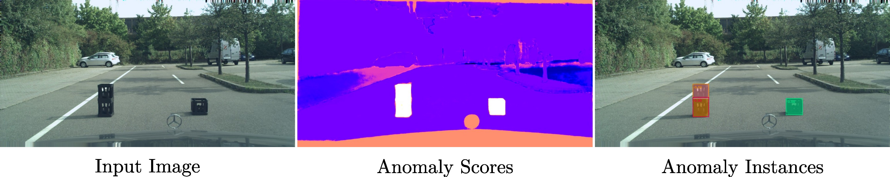

# UGainS: Uncertainty Guided Anomaly Instance Segmentation (GCPR 2023)
<div align="center">
<a href="https://nekrasov.dev/">Alexey Nekrasov</a><sup>1</sup>, <a href="https://www.vision.rwth-aachen.de/person/10/">Alexander Hermans</a><sup>1</sup>, <a href="https://www.linkedin.com/in/lars-kuhnert/">Lars Kuhnert</a><sup>2</sup>, <a href="https://www.vision.rwth-aachen.de/person/1/">Bastian Leibe</a><sup>1</sup>

<sup>1</sup>RWTH Aachen University, <sup>2</sup>Ford Motor Company

UGainS is an approach that provides anomaly instance segmentation and per-pixel anomaly scores.

<a href="https://pytorch.org/get-started/locally/"></a>
<a href="https://pytorchlightning.ai/"></a>
<a href="https://hydra.cc/"></a>
<a href="https://black.readthedocs.io/en/stable/"></a>



</div>
<br><br>

[[Project Webpage](https://vision.rwth-aachen.de/ugains)] [[arXiv](https://arxiv.org/abs/2308.02046)]

## News

* **2023-07-14**: Paper Accepted at [GCPR 2023](https://www.dagm-gcpr.de/year/2023)
* **2023-08-03**: Paper on arXiv
* **2024-04-18**: Code release
* **2024-06-15**: New benchmark! [OoDIS: Anomaly Instance Segmentation Benchmark](https://vision.rwth-aachen.de/oodis)

## Code
I took a long time to release the code, mainly because it was a lot of hacking together at the time and didn't really have a concise structure with multiple commented lines instead of having configs and hardwired paths all over the code.
To make the code understandable, I reduced the context a bit.
This version only contains experiments for a single dataset, but provides a clean overview of the project.
Please feel free to open a github issue if you have any questions or need help with the code.

## Installation

### Prerequisites
- Python 3.11
- CUDA 11.8
- cuDNN 8.6.0

### Setting Up Your Environment
It is recommended to use a virtual environment for the project to manage dependencies effectively.

1. **Create and activate a virtual environment** (optional but recommended):
   ````bash
   python -m venv venv
   source venv/bin/activate
   ````

2. **Install dependencies**:
   Ensure you have Poetry installed. If not, install Poetry using the following command:
   ````bash
   pip install poetry
   ````

   Install Mask2former ops:
   ```
   cd ugains/models/mask2former/pixel_decoder/ops/
   bash make.sh
   cd ../../../../..
   ```

   Install FPS:
   ```
   cd third_party/pointnet2
   python setup.py install
   ```

   Then, install the project dependencies with Poetry:
   ````bash
   poetry install
   ````

## Example Usage

To run the model with the specified configuration, use the following command:
```bash
poetry run test datamodule=cityfishy model=sam_sampling logger=csv experiment=experiment description=description
```

## Dependencies
The project relies on several key Python packages, including but not limited to:
- PyTorch (`torch>=2.0.1`)
- TorchVision (`torchvision>=0.15.2`)
- PyTorch Lightning (`pytorch-lightning>=2.0.2`)
- Hydra Core (`hydra-core>=1.3.2`)
- Weights & Biases (`wandb>=0.15.2`)
- Albumentations (`albumentations>=1.3.0`)
- Rich (`rich>=13.3.5`)
- Python-dotenv (`python-dotenv>=1.0.0`)
- Fire (`fire>=0.5.0`)
- Joblib (`joblib>=1.2.0`)
- Ninja (`ninja>=1.11.1`)
- GitPython (`gitpython>=3.1.31`)
- Pandas (`pandas>=2.0.1`)
- Seaborn (`seaborn>=0.12.2`)
- Matplotlib (`matplotlib>=3.7.1`)
- Numpy (`numpy>=1.24.3`)
- pycocotools
- einops
- git+https://github.com/mcordts/cityscapesScripts.git


## Data Preparation
```
data
├── fs_lost_found
│   ├── leftImg8bit
│   └── gtCoarse
│       ├── train
│       └── test
│           ├── xx_xxx_000000_000000_gtCoarse_labelTrainIds.png
│           └── ...
├── fs_lost_found_instance
│   └── gtCoarse
│       ├── train
│       └── test
│           ├── xx_xxx_000000_000000_gtCoarse_instanceIds.png
│           └── ...
├── ignore_mask.pth
├── rude0fhk.ckpt
└── sam_vit_h_4b8939.pth
```
Instance labels, Mask2Former model, and ignore mask could be downloaded [here](https://omnomnom.vision.rwth-aachen.de/data/ugains/).
Sam checkpoint could be downloaded from [here](https://github.com/facebookresearch/segment-anything).
Lost and Found images could be found [here](https://wwwlehre.dhbw-stuttgart.de/~sgehrig/lostAndFoundDataset/index.html), and validation images from Fishyscapes Lost and Found [here](https://fishyscapes.com/dataset).

## BibTeX
```
@inproceedings{nekrasov2023ugains,
  title     = {{UGainS: Uncertainty Guided Anomaly Instance Segmentation}},
  author    = {Nekrasov, Alexey and Hermans, Alexander and Kuhnert, Lars and Leibe, Bastian},
  booktitle = {GCPR},
  year      = {2023}
}
```

## Thanks
A big thanks to the authors of Mask2Former, DenseHybrid, SegmentAnything, PEBAL and all the others.
